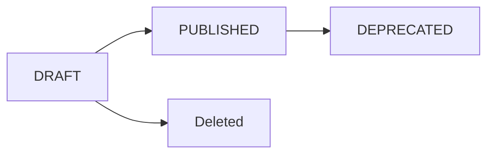

WhatsApp Flows let you build rich, multi-step interactive experiences — such as forms, surveys, and booking flows — that users complete entirely within the WhatsApp app. Flows are created via the API and then sent to users as interactive messages.

## Endpoints

| Method   | Path | Description |
| -------- | ---- | ----------- |
| `POST`   | `/whatsapp/flows` | Create a Flow |
| `GET`    | `/whatsapp/flows` | List Flows |
| `GET`    | `/whatsapp/flows/{flowId}` | Retrieve a Flow |
| `PATCH`  | `/whatsapp/flows/{flowId}` | Update flow metadata |
| `PATCH`  | `/whatsapp/flows/{flowId}/updateStructure` | Update flow structure (JSON) |
| `POST`   | `/whatsapp/flows/{flowId}/publish` | Publish a Flow |
| `POST`   | `/whatsapp/flows/{flowId}/deprecate` | Deprecate a Flow |
| `DELETE` | `/whatsapp/flows/{flowId}` | Delete a Flow |
| `GET`    | `/whatsapp/flows/{flowId}/preview` | Generate a web preview URL |

---

## Flow lifecycle



- **DRAFT** — The Flow is being edited. It can be updated and tested, but not sent to users.
- **PUBLISHED** — The Flow is live and can be sent to users as an interactive message.
- **DEPRECATED** — The Flow can no longer be sent to new users, but existing open sessions continue.

---

## Create a Flow

`POST https://api.ycloud.com/v2/whatsapp/flows`

<ParamField body="wabaId" type="string" required>
  The WhatsApp Business Account ID to create the Flow under.
</ParamField>

<ParamField body="name" type="string" required>
  A display name for the Flow (max 60 characters).
</ParamField>

<ParamField body="categories" type="array" required>
  Array of category strings. Common values: `SIGN_UP`, `SIGN_IN`, `APPOINTMENT_BOOKING`, `LEAD_GENERATION`, `CONTACT_US`, `CUSTOMER_SUPPORT`, `SURVEY`, `OTHER`.
</ParamField>

<CodeGroup>

```bash cURL
curl -X POST https://api.ycloud.com/v2/whatsapp/flows \
  -H "X-API-Key: YOUR_API_KEY" \
  -H "Content-Type: application/json" \
  -d '{
    "wabaId": "waba_01h9xyz",
    "name": "Customer Feedback Survey",
    "categories": ["SURVEY"]
  }'
```

```javascript Node.js
const response = await fetch('https://api.ycloud.com/v2/whatsapp/flows', {
  method: 'POST',
  headers: {
    'X-API-Key': 'YOUR_API_KEY',
    'Content-Type': 'application/json',
  },
  body: JSON.stringify({
    wabaId: 'waba_01h9xyz',
    name: 'Customer Feedback Survey',
    categories: ['SURVEY'],
  }),
});
```

</CodeGroup>

---

## Update flow structure

`PATCH https://api.ycloud.com/v2/whatsapp/flows/{flowId}/updateStructure`

Updates the flow JSON that defines the screens and UI components.

<ParamField body="flowJson" type="string" required>
  The Flow JSON as a string, following the [WhatsApp Flows JSON schema](https://developers.facebook.com/docs/whatsapp/flows/reference/flowjson).
</ParamField>

---

## Publish a Flow

`POST https://api.ycloud.com/v2/whatsapp/flows/{flowId}/publish`

Transitions the Flow from `DRAFT` to `PUBLISHED`. Once published, the Flow cannot be edited — you must deprecate it and create a new version.

<CodeGroup>

```bash cURL
curl -X POST \
  https://api.ycloud.com/v2/whatsapp/flows/flow_01h9xyz/publish \
  -H "X-API-Key: YOUR_API_KEY"
```

```javascript Node.js
await fetch(
  'https://api.ycloud.com/v2/whatsapp/flows/flow_01h9xyz/publish',
  {
    method: 'POST',
    headers: { 'X-API-Key': 'YOUR_API_KEY' },
  }
);
```

</CodeGroup>

---

## Deprecate a Flow

`POST https://api.ycloud.com/v2/whatsapp/flows/{flowId}/deprecate`

Prevents the Flow from being sent to new users. Existing open sessions are not affected.

---

## Generate a preview URL

`GET https://api.ycloud.com/v2/whatsapp/flows/{flowId}/preview`

Returns a temporary web URL where you can preview the Flow in a browser without opening WhatsApp.

<ResponseField name="previewUrl" type="string">
  The temporary URL to preview the Flow.
</ResponseField>

<ResponseField name="expiresAt" type="string">
  ISO 8601 timestamp when the preview URL expires.
</ResponseField>

---

## Delete a Flow

`DELETE https://api.ycloud.com/v2/whatsapp/flows/{flowId}`

Permanently deletes a Flow. Only `DRAFT` Flows can be deleted.

<Warning>
  You cannot delete a `PUBLISHED` or `DEPRECATED` Flow. Deprecate it first, then contact YCloud support if permanent removal is needed.
</Warning>
